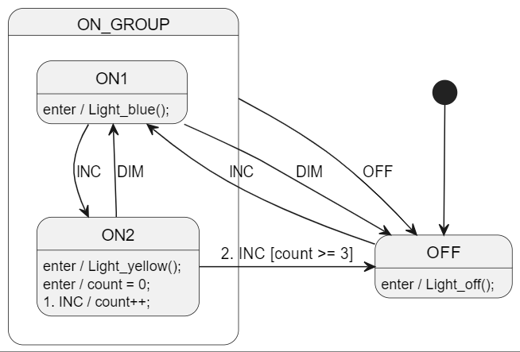

# Adding a new language to StateSmith
First of all, thank you!!! I really appreciate your help in allowing more people to use StateSmith.

This can be a bit tricky, but I'll do my best to help you with it.

# NOTE!
You don't need to run any `.csx` files or `ss.cli` commands in this directory. We are just concerned with manual translation first.

 

# Step 0 - open an issue
Please open a new issue with the language to support before doing any significant work on it. This will help coordinate efforts. Maybe someone else is already working on it or has some insights to share.

The current default StateSmith [algorithm](https://github.com/StateSmith/StateSmith/wiki/Algorithms) requires something like switch/case statements. If your language doesn't support this, it will be a bit more challenging to implement. We also have a function pointer based algorithm although I prefer starting with simpler switch/case if possible.

 

# Step 1 - manual code translation
Let's start simple. We'll manually translate a tiny hierarchical state machine into the new language.

In this directory, you will find C99/CSharp/JavaScript/... code generated by StateSmith for the following state machine:

Pick one of the existing languages that is closest to your target language and manually translate.

See [./new-lang/README.md](./new-lang/README.md) for more details.

 

# Step 2 - open a PR
Open a PR into this repository with the translated code. This will make it easy for us to discuss the approach.

Related discussion: https://github.com/StateSmith/StateSmith/discussions/374
